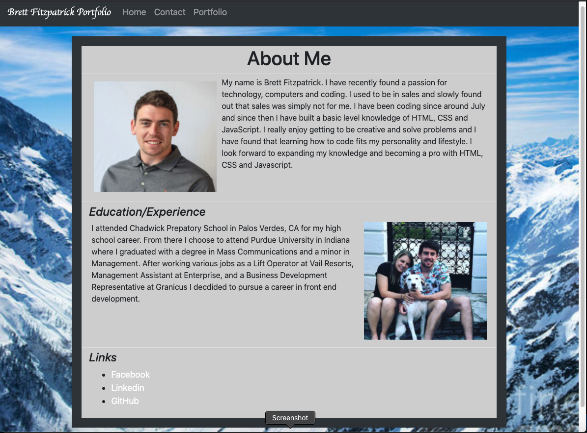
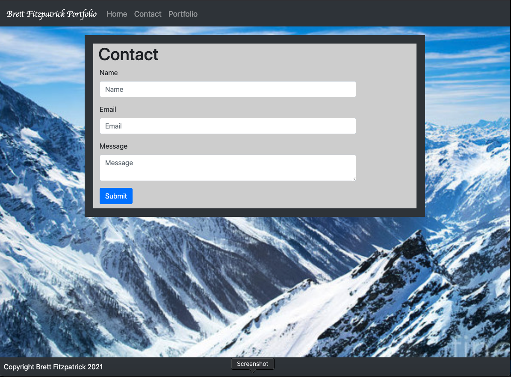
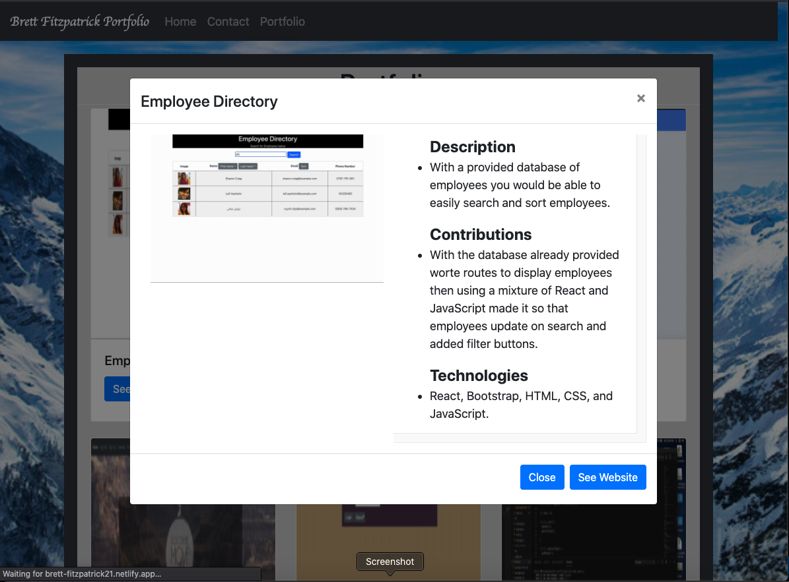
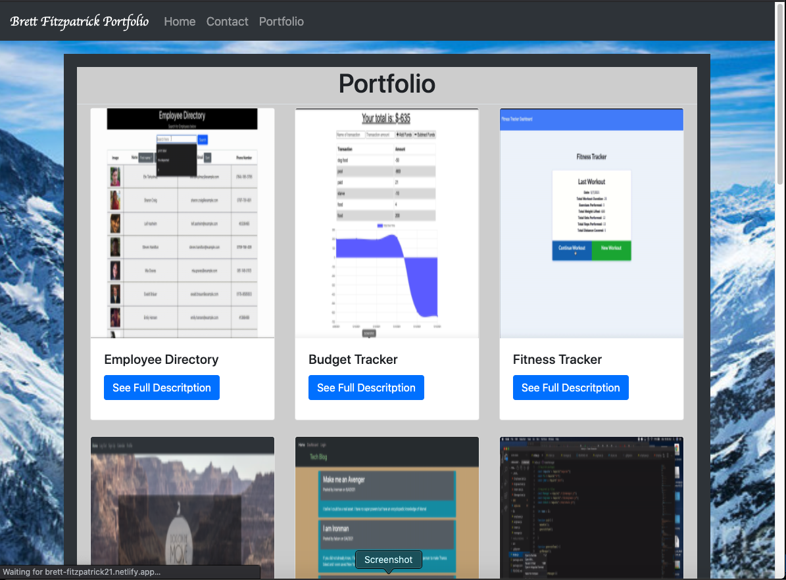

# React-Portfolio-2.0
[](https://opensource.org/licenses/MIT)

## Description
My personal portfolio displaying all projects that I have done.

[link](https://brett-fitzpatrick21.netlify.app/)









## Table of Contents
* [Installation](#installation)
* [Usage](#usage)
* [Contribute](#contribute)
* [Questions](#questions)
## Installion
For this project be sure to run the following command in your terminal to install the necessary dependencies.
```
npm i
```

## Usage
click on various links to see projects that I have worked on.
## License
MIT## Contribute

email bfitzpatrick28@gmail.com

## Questions
If you have any questions at all please reach out to [fitzpatb](https://github.com/fitzpatb/React-Portfolio-2.0) or email directly at bfitzpatrick28@gmail.com